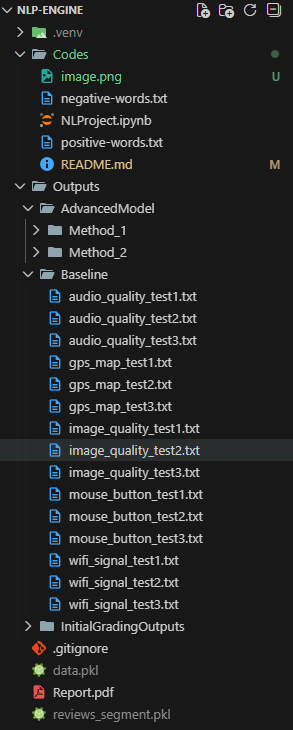

Make sure you have a valid version of Python installed: https://www.python.org/downloads/
The "NLProject.ipynb" file is where all of our code resides in.
Install all neccessary packages by using "pip install {package_name}", like for example you are in a valid Python enviroment, and you see a yellow squiggly line under pandas.
You would do "pip install pandas". Do this for all packages you see this for.

This is our file structure:

Note if your file structure does not match this, your code may not properly run, please ensure correct file structure as shown above so code can execute successfully.